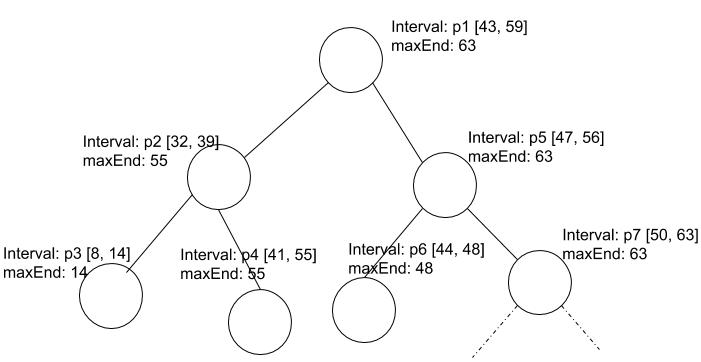

# P4

## Annoucments

Corrections, clarifications, and other announcements regarding this programming assignment will be found below.

- **4/7: **IntervalTreeADT.findOverlapping() method must include intervals which overlap on the edge point as well. For example: p1 [4, 10] and p2 [10, 15] will overlap. Javadocs for this method should be: if left subtree's max is greater than **or equal** to the interval's start, call findOverlappingHelper in the left subtree.if right subtree's max is greater than **\*or equal*** to the interval's start, call call findOverlappingHelper in the rightSubtree.The javadocs have been updated and p4.zip has been updated with this change in the method comments for IntervalTreeADT.findOverlapping() ADT
- **4/7: **In IntervalTreeMain, it throws NullPointerException if you don't pass in argument datafile in the interactive mode as well. There are two ways to deal with it: either pass in datafile "java IntervalTreeMain 1 datafile" or apply the fix described in this piazza note here: [https://piazza.com/class/ixvb3zbhyqd29e?cid=515 (Links to an external site.)](https://piazza.com/class/ixvb3zbhyqd29e?cid=515). Either way it doesn't affect the correctness of your program's TODOs.
- **3/27:** In IntervalTreeADT insert method comments: ...Use the comparator defined in **Interval** and create a new IntervalNode to store the new interval
- p4 Teams will be the same as p3 teams.
- **3/27:** Program 4 assigned. A link to Piazza is available for students to ask questions about the assignment.
- REMINDER: Students may share work only with other members of their same team.  Students caught posting course work online (i.e. for seeking help or a paid programmer) will get a zero on the assignment and potentially fail the course.

 Overview

### Goals

The goals of this assignment are to:

- Understand, implement, and use a Binary Search Tree type
- Introduce you to a new ADT, an Interval Tree
- Write classes that implement Java interfaces
- Gain experience working with Java references
- Implement methods recursively (in most cases using a recursive helper method).

### Description

In this project, you will implement a basic version of Schedule Planner. In every semester, we have a number of days (let's say days are numbered 1 through 120) and we have multiple courses each with multiple assignments. For example, CS367 has projects P1 through P5 and each project is available within a specified time window (e.g., P1 day 20 through day 40, P2 day 22 through day 35 and so on). In this assignment, we will construct a data structure to store projects with time-windows during which they are available and will answer questions like: If your birthday is on day 51st, how many/what all projects will "overlap" with your birthday. Suppose, you enrolled in another class, so you would want to "insert" a new Project and time-window in your schedule planner.

We will represent above schedules as intervals. Each interval is represented as  <label> [start  end] where label is the name of the project/schedule and [start  end] represents the span of the project/appointment in your calendar. There can be overlapping intervals: e.g., P1 [10 30], P2 [20 27], here P1 and P2 have overlapping time-windows. You will write a variation of Binary Search Tree called IntervalTree to store these intervals and support various queries (see below for what queries are supported). Each node will represent a project schedule/appointment. Each node will have [start, end] as its **data** values, and the **key** for comparison will be first the 'start' value and then if 'start' are same, you'll compare the 'end' values. Each node in the IntervalTree will also store a **maxEnd** variable which represents the maximum end present in the subtree rooted at node 'n'.  For example, a diagram of such a tree may look like this:

 

As you can see in the above tree, each node represents the interval which denotes the appointment/schedule in your calendar. Notice that **maxEnd** is the maximum end in the *subtree* rooted at that node. So, if you delete/insert an interval, it's going to affect the **maxEnd** of possibly multiple nodes in the path from root to the node you deleted/inserted.

Purpose of **maxEnd**: **maxEnd** is used to reduce the search complexity of the program. For example, in the tree shown above, if we are searching for intervals overlapping [58 65], we can avoid left subtree as its maxEnd is 55 so no interval will overlap with the target input interval. You should keep this in mind while writing your code.

## Specifications

### Operations supported

1. **Insert Schedule**: This operation will let the user enter the schedule as an Interval specified by<label> [start, end] and will insert this into the IntervalTree. Remember to update the maxEnd of the affected nodes as you insert a new interval.

2. **Delete Schedule**: This operation will let the user enter the schedule<label> [start, end] and will remove it from the tree. So essentially you will remove the node with the specified interval. Remember to update the maxEnd of the affected nodes.

3. **Find** **Overlap Schedule**: This operation will allow the user to enter a schedule [start, end] and will return all the schedules which overlap with the input schedule. For example, in above tree, for interval [30 42], the program will return [32 39], [41 55].

4. **Schedules Containing Point**:** **This will return a list of intervals containing the input point. For example, suppose we have intervals [12 15], [20 30], [13 18] in our tree, and input point is 15, then the program will return intervals [12 15], [13 18].  Labels of each interval are not considered for matches.

5. **Print Tree Stats**: This will print out the stats such as number of nodes and height of the tree.

6. **Show Tree Viewer**: This will launch a window to show Tree. You can use it to debug your tree.

7. **Quit**: This will quit the program.

## Important Types (classes and interfaces)

#### interface IntervalADT (provided to you -- do not change)

IntervalADT defines the interface for representing targets. You must implement all methods in a new class Interval.

#### **interface IntervalTreeADT (provided to you -- do not change)**

This interface defines required operations of the IntervalTree. It has functions for tree operations like: insert, delete, height, size. You must implement all of these functions in a new class IntervalTree.

#### 

### Classes that you must define or complete:

#### class Interval implements IntervalADT (TODO -- complete this class)

This class implements the **IntervalADT** interface.  Create, edit, and submit this file.

#### class IntervalTree implements IntervalTreeADT (TODO -- complete this class)

This class implements the **IntervalTreeADT** interface.  Create, edit, and submit this file.

#### class IntervalNode (TODO -- complete this class)

This class has been partially defined for you.  It implements the getter and setters for node members and it provides a getSuccessor() method to get the in-order successor of the node.  You must implement the getSuccessor() method.

#### 

### To program run program, execute IntervalTreeMain

This class contains the main method of the program.  It has been provided to you and you should not need to edit.

The program runs in one of two modes: (1) InteractiveMode and (2) nonInteractive mode.

The interactive mode opens up a main menu interface where you can specify operations to do with the tree (e.g., insert, delete, print stats, etc.).

Non-interactive mode runs the program using a text-file which contains a bunch of intervals and runs some queries e.g., insert/delete/overlap etc. In order to debug and/or develop program incrementally, you may prefer to use the Interactive mode.

- javac *.java
- java IntervalTreeMain 1

Alternatively specify "1" (without quotes) in the Arguments tab in Eclipse Run Configuration.

The following is a sample Input/Output sequence:.

```
Welcome to Schedule Planner!
=============================

1. Insert Schedule
2. Delete Schedule
3. Find Overlapping Schedules
4. Schedules Containing Point
5. Print Tree Stats
6. Show Tree Viewer
7. Quit Program

Enter Choice: 1
Selected Insert Schedule
Enter <label start end>: 
p1 5 10
Successfully inserted: p1 [5, 10]

1. Insert Schedule
2. Delete Schedule
3. Find Overlapping Schedules
4. Schedules Containing Point
5. Print Tree Stats
6. Show Tree Viewer
7. Quit Program

Enter Choice: 1
Selected Insert Schedule
Enter <label start end>: 
p2 2 15
Successfully inserted: p2 [2, 15]

1. Insert Schedule
2. Delete Schedule
3. Find Overlapping Schedules
4. Schedules Containing Point
5. Print Tree Stats
6. Show Tree Viewer
7. Quit Program

Enter Choice: 1
Selected Insert Schedule
Enter <label start end>: 
p3 12 20
Successfully inserted: p3 [12, 20]

1. Insert Schedule
2. Delete Schedule
3. Find Overlapping Schedules
4. Schedules Containing Point
5. Print Tree Stats
6. Show Tree Viewer
7. Quit Program

Enter Choice: 1
Selected Insert Schedule
Enter <label start end>: 
p4 10 30
Successfully inserted: p4 [10, 30]

1. Insert Schedule
2. Delete Schedule
3. Find Overlapping Schedules
4. Schedules Containing Point
5. Print Tree Stats
6. Show Tree Viewer
7. Quit Program

Enter Choice: 5
Selected Tree Stats
-----------------------------------------
Height: 3
Size: 4
-----------------------------------------

1. Insert Schedule
2. Delete Schedule
3. Find Overlapping Schedules
4. Schedules Containing Point
5. Print Tree Stats
6. Show Tree Viewer
7. Quit Program

Enter Choice: 6
Selected Show Tree Viewer
```

```
1. Insert Schedule
2. Delete Schedule
3. Find Overlapping Schedules
4. Schedules Containing Point
5. Print Tree Stats
6. Show Tree Viewer
7. Quit Program

Enter Choice: 2
Selected Delete Schedule
Enter <label start end>: 
p4 10 30
Successfully deleted p4 [10, 30]

1. Insert Schedule
2. Delete Schedule
3. Find Overlapping Schedules
4. Schedules Containing Point
5. Print Tree Stats
6. Show Tree Viewer
7. Quit Program

Enter Choice: 2
Selected Delete Schedule
Enter <label start end>: 
p4 5 30
Interval: p4 [5, 30] not found in the tree.

1. Insert Schedule
2. Delete Schedule
3. Find Overlapping Schedules
4. Schedules Containing Point
5. Print Tree Stats
6. Show Tree Viewer
7. Quit Program

Enter Choice: 4
Selected Schedules Containing Point
Enter <point>: 
12
Following schedules contain the input point 12:
p2 [2, 15] p3 [12, 20] 

1. Insert Schedule
2. Delete Schedule
3. Find Overlapping Schedules
4. Schedules Containing Point
5. Print Tree Stats
6. Show Tree Viewer
7. Quit Program

Enter Choice: 5
Selected Tree Stats
-----------------------------------------
Height: 2
Size: 3
-----------------------------------------

1. Insert Schedule
2. Delete Schedule
3. Find Overlapping Schedules
4. Schedules Containing Point
5. Print Tree Stats
6. Show Tree Viewer
7. Quit Program

Enter Choice: 3
Selected Find Overlapping Schedules
Enter <start end>: 
15 30
Your input overlaps following schedules:
p2 [2, 15] p3 [12, 20] 

1. Insert Schedule
2. Delete Schedule
3. Find Overlapping Schedules
4. Schedules Containing Point
5. Print Tree Stats
6. Show Tree Viewer
7. Quit Program

Enter Choice: 3
Selected Find Overlapping Schedules
Enter <start end>: 
1 100
Your input overlaps following schedules:
p1 [5, 10] p2 [2, 15] p3 [12, 20] 

1. Insert Schedule
2. Delete Schedule
3. Find Overlapping Schedules
4. Schedules Containing Point
5. Print Tree Stats
6. Show Tree Viewer
7. Quit Program

Enter Choice: 4
Selected Schedules Containing Point
Enter <point>: 
15
Following schedules contain the input point 15:
p2 [2, 15] p3 [12, 20] 

1. Insert Schedule
2. Delete Schedule
3. Find Overlapping Schedules
4. Schedules Containing Point
5. Print Tree Stats
6. Show Tree Viewer
7. Quit Program

Enter Choice: 7
Good Bye!
```

**The GUI: IntervalTreeGUI**

This class defines a Graphical User Interface (GUI) viewer. You can use this class as part of your development efforts.  It will show you three levels of your interval tree. You don't have to use or modify this class.  But, it may help you visualize what the next three levels including the specified IntervalNode.  Such visualizations are especially useful if things are not working as expected. You can traverse the tree using this GUI. Just click on any node and it will show next three levels from that node onward. Click the red button to go back to the root of the tree.

**CAUTION: Remove all calls to "view" nodes using this GUI before submitting your work.   DO NOT HAND IN THE IntervalTreeGUI class.** 

## Javadocs

See [javadocs](http://pages.cs.wisc.edu/~cs367-1/assignments/p4/javadocs/index.html) for all classes provided to you.

You may **not** add any other public methods than those listed in the provided files.

You may add private (non-static) data members and private helper methods as needed.

Do **not** modify any provided class in any way except where noted as "//TODO".

## Steps

After you have read this program page and given thought to the problem we suggest the following steps:

- Your p4 team will be responsible for a single submission.  Though, we do recommend that all teammates be sure to check and submit well before the due date to ensure that there are no sad faces if the one who said they would submit does not submit successfully.
- Review the [commenting](https://canvas.wisc.edu/courses/23073/pages/program-commenting-guide) and [style](https://canvas.wisc.edu/courses/23073/pages/program-style-guide) standards that are used to evaluate your program.
- You may use the Java development environment of your choice in CS 367. *However, all programs must compile and run on the lab computers for grading.* If you are going to use the CS lab computers, we recommend that you use Eclipse. You may want to review the [Eclipse tutorial](http://pages.cs.wisc.edu/%7Ecs302/labs/EclipseTutorial/) to learn the basics. Note that on the Linux lab computers, you should enter "eclipse&" at the prompt instead of what is described in the tutorial.
- **Download this p4.zip file to a programming assignment p4 folder that you make. ** Unzip to place all files in your p4 program folder.
- Write test classes and test methods to see if the classes and methods that you are defining work as you intend.
- Work on code that is the least dependent upon other code working first.  A good order for this program is:
  - define class Interval 
  - complete class IntervalNode 
  - define IntervalTree 
- There is no need to complete an entire class before testing.  It is best if you work on small parts and completely test those parts before moving on to other parts.
- If you are not using the lab computers to develop your program, make sure you compile and run your program to ensure that it works on the Linux lab computers. You can compile your Java source using javac in a terminal window as in this example:
- - javac *.java
  - and then run your program using java:
    - For interactive mode (use this to run in interactive mode and iteratively develop your program): 
      **java IntervalTreeMain 1**
    - For non-interactive mode: 
      **java IntervalTreeMain 2 data_01.txt**
- Submit your work for grading. We will thoroughly test individual classes and run end-to-end tests on your entire program (using the files we provided).
  - Program's robustness for handling null keys and throwing appropriate exceptions

## Submitting Your Work

- **CAUTION: If you have not logged in to Canvas within the last 30 minutes, your handin may not complete due to a session timeout.  To avoid this:****Log out of Canvas****Log back in to Canvas****This will refresh your session and ensure that there will not be a timeout while you are submitting files.**
- Late work is not accepted.
- Make sure your code follows the [style](https://canvas.wisc.edu/courses/23073/pages/program-style-guide) and [commenting](https://canvas.wisc.edu/courses/23073/pages/program-commenting-guide) standards.
- Make sure your program runs on the CS Linux workstations (Rm 1366 CS)
- All classes must belong to the default package. (No package declaration at top of class).
- Submit the following files:
- - IntervalTree.java
  - IntervalNode.java
  - Interval.java 
- Double-check that the files that you submitted are the work you wanted graded.  We will not accept late work.  We can only grade work that you submit successfully before the due date and time.

